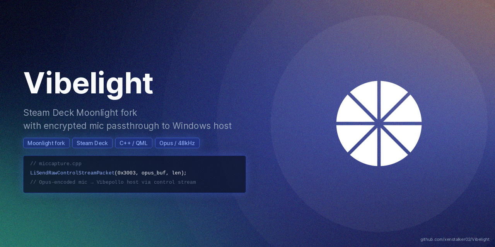

> **Vibelight** is a fork of
> [moonlight-stream/moonlight-qt](https://github.com/moonlight-stream/moonlight-qt)
> that adds **client-side microphone capture and passthrough** for use with
> [Vibepollo](https://github.com/xenstalker02/Vibepollo) on the Windows host.

[](LICENSE)

---

## What Is This?

Moonlight streams games from your PC to your Steam Deck but ignores the Steam Deck
microphone. Vibelight fixes that by capturing mic audio on the Steam Deck, encoding it
with Opus, and streaming it back to the host PC where it appears as a virtual microphone
that Discord, games, and voice chat apps can use normally.

Vibelight is the client side. It pairs with
**[Vibepollo](https://github.com/xenstalker02/Vibepollo)** on the Windows host.

---

## Features

- **Mic passthrough** — captures Steam Deck mic, Opus-encodes it, streams to host
- **Encrypted transport** — mic data rides the AES-GCM encrypted control stream.
  The host refuses unencrypted mic sessions.
- **Steam Streaming Microphone host backend** — Vibepollo renders decoded audio
  directly to the Steam Streaming Microphone endpoint (no third-party driver
  required). VB-Audio Virtual Cable is the automatic fallback if unavailable.
- **Opus audio** — 64kbps mono, complexity 10, FEC enabled, explicit 20ms frame duration.
  Optimized for voice quality and packet loss resilience.
- **Deadline-based send pacer** — sends frames at exactly 20ms intervals with re-sync
  guard. Eliminates jitter from SDL2 timer irregularities for clean audio.
- **12-frame buffer cap** — prevents audio backup during capture irregularities,
  always dropping oldest frames to keep latency low.
- **Device fallback** — if a named device fails, automatically falls back to default mic
- **Frame spec mismatch detection** — detects and logs SDL2 format mismatches without crashing
- **All Moonlight features** — video streaming, HDR, controller support, and everything
  from upstream Moonlight

---

## Requirements

- Steam Deck (SteamOS) — primary supported platform
- [Vibepollo](https://github.com/xenstalker02/Vibepollo) running on Windows host
- Linux desktop: planned (SDL2 is cross-platform, packaging needed)

---

## Installation (Steam Deck)

One command:

```bash
curl -sSL https://raw.githubusercontent.com/xenstalker02/Vibelight/master/install.sh | bash
```

Or clone and install:

```bash
git clone https://github.com/xenstalker02/Vibelight.git
cd Vibelight
bash install.sh
```

The installer builds and installs the Flatpak. Mic capture is **opt-in** — enable it in Settings → Microphone Capture after installing.
Safe to re-run on update — fully idempotent.

---

## Configuration

Edit the Moonlight config file at:
`~/.var/app/com.moonlight_stream.Moonlight/config/Moonlight Game Streaming Project/Moonlight.conf`

| Option | Default | Description |
|--------|---------|-------------|
| `micCapture` | `false` | Enable mic capture and passthrough. **Opt-in — disabled by default.** Enable in Settings → Microphone Capture before streaming. |
| `micDevice` | (empty) | Specific mic device name. Leave empty to use the default mic (built-in Steam Deck mic). Set to your Bluetooth or USB mic device name to use an external device. |
| `micBitrate` | `64000` | Opus bitrate in bps. Adjustable via the Bitrate slider in Settings (32–128 kbps, default 64 kbps). |
| `absoluteMouseMode` | `false` | Set false for Steam trackpad mouse compatibility |
| `mouseAcceleration` | `false` | Set false for consistent pointer feel |

> **Deck built-in mic gain note:** The Steam Deck's built-in microphone runs at
> high gain by default and will clip on loud input. During installation, PipeWire
> capture volume is set to 50% to prevent clipping:
> ```bash
> pactl set-source-volume @DEFAULT_SOURCE@ 50%
> ```
> If mic audio sounds distorted, re-run this command.

---

## Headphones and Echo

The Deck's built-in microphone is physically close to its speakers. If game audio
is playing through the Deck's speakers while mic passthrough is active, the mic
will pick up the speaker output and create an echo loop on the host.

**Use headphones or a headset on the Deck during any session where mic passthrough
is enabled.** This is not a software limitation — it is a physical constraint of
the hardware layout.

---

## Using Bluetooth Headphones

Vibelight supports using Bluetooth headphones (e.g. Nothing Ear (1), Sony WH-1000XM5, or any
Bluetooth headset) as the microphone source:

1. Pair your headphones on the Steam Deck in Desktop Mode (Settings → Bluetooth)
2. In SteamOS, the Bluetooth headset mic appears as a PipeWire device
3. Find the device name:
   ```bash
   pactl list sources short | grep -i bluetooth
   ```
4. Set `micDevice` in Moonlight.conf to the device name shown (e.g.
   `bluez_input.XX_XX_XX_XX_XX_XX.0`)

If the named device is unavailable at session start, Vibelight automatically falls back
to the default microphone.

---

## Security

Mic audio is sent over the AES-GCM encrypted Moonlight control stream.
The host (Vibepollo) refuses to render mic audio from clients that did not negotiate
an encrypted session. No plaintext mic audio is ever transmitted.

---

## How It Works

```
Steam Deck mic (or USB/Bluetooth mic)
→ SDL2 capture (48kHz, 16-bit, stereo or mono)
→ (L+R)/2 downmix to mono
→ 12-frame ring buffer (jitter smoothing)
→ Opus encode (64kbps mono, FEC, complexity 10, FRAMESIZE_20_MS)
→ 4-byte header prepended (channel/flags)
→ Deadline-based pacer (20ms intervals, re-sync guard)
→ AES-GCM encrypted control stream
→ Vibepollo: jitter buffer (40ms) → Opus decode
→ Steam Streaming Microphone (primary) or CABLE Input (fallback)
→ Windows default capture switches to Steam mic or CABLE Output
→ Discord/games hear mic automatically
```

---


## Platform Support

| Platform | Status |
|----------|--------|
| Steam Deck (SteamOS) | Supported |
| Linux desktop | Planned |
| Windows | Not planned |
| macOS | Not planned |

---

## Steam Deck Art

Custom Steam Grid artwork is included in [`steamgridDB/`](steamgridDB/). Apply it via [SGDBoop](https://www.steamgriddb.com/boop) with [Decky Loader](https://decky.xyz), or copy the files manually into your Steam grid directory.

| File | Type | Size |
|------|------|------|
| [`capsule_920x430.png`](steamgridDB/capsule_920x430.png) | Capsule (landscape) | 920×430 |
| [`capsule_600x900.png`](steamgridDB/capsule_600x900.png) | Capsule (portrait) | 600×900 |
| [`hero_3840x1240.png`](steamgridDB/hero_3840x1240.png) | Hero image | 3840×1240 |
| [`tile_660x930.png`](steamgridDB/tile_660x930.png) | Galaxy tile | 660×930 |
| [`bg_1600x650.png`](steamgridDB/bg_1600x650.png) | Background | 1600×650 |
| [`square_1024x1024.png`](steamgridDB/square_1024x1024.png) | Square grid | 1024×1024 |
| [`icon_1024x1024.png`](steamgridDB/icon_1024x1024.png) | Icon | 1024×1024 |
| [`logo_512x140.png`](steamgridDB/logo_512x140.png) | Logo | 512×140 |

---

## Related Projects

| Project | Description |
|---------|-------------|
| [Vibepollo](https://github.com/xenstalker02/Vibepollo) | Companion server-side fork |
| [logabell/moonlight-qt-mic](https://github.com/logabell/moonlight-qt-mic) | Parallel client mic implementation — **not compatible with Vibelight** (uses LiSendMicrophoneOpusDataEx on a separate UDP port; Vibelight uses 0x3003 on the encrypted control stream) |
| [moonlight-stream/moonlight-qt](https://github.com/moonlight-stream/moonlight-qt) | Upstream Moonlight |
| [ClassicOldSong/Apollo](https://github.com/ClassicOldSong/Apollo) | Apollo (server) upstream |

---

## Acknowledgments

Mic passthrough was developed in parallel with
[logabell/moonlight-qt-mic](https://github.com/logabell/moonlight-qt-mic).
We adopted Opus encoder tuning (64kbps mono, FEC, VBR, complexity 10, FRAMESIZE_20_MS)
and the deadline-based send pacer from that work after comparing implementations.